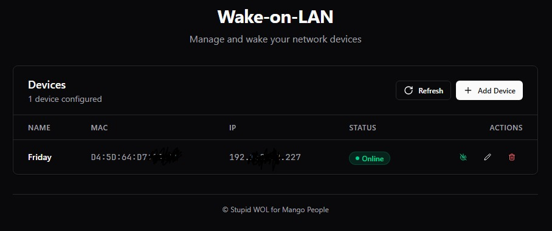

# Pi-WOL

A dead-simple Wake-on-LAN web interface built for a Raspberry Pi Model B+.

Existing WOL projects all want Docker, which is deprecated on the old ARMv6 Pi. I'm not buying a new Pi just to run a container, so I made this stupid script instead. It's a single Flask app with a Vue 3 frontend styled with Tailwind CSS (shadcn aesthetic) — no Docker, no bloat, just wake your machines.



> [!CAUTION]
> **No authentication is included.** This app is designed for private/home networks only. There is no login, no auth gate, nothing. **Please do not expose it to the public internet.** If you need remote access, put it behind [Tailscale](https://tailscale.com/) or a VPN.

## Features

- **Add / Edit / Delete** network devices (stored in a JSON file)
- **Wake-on-LAN** with one click (magic packet over raw socket)
- **Auto-detect IP** from MAC via ARP table lookup
- **Live status polling** — pings devices every 10 seconds
- **Dark mode** shadcn/ui-inspired design with Tailwind CSS v4
- **Mobile-friendly** responsive card layout
- **Systemd service** — runs on port 9090 as `www-data` in production

## Tech Stack

| Layer    | Tech                          |
|----------|-------------------------------|
| Backend  | Python / Flask / Gunicorn     |
| Frontend | Vue 3 (SFC) / Tailwind CSS v4 |
| Build    | Vite                          |
| Deploy   | systemd                       |

---

## Deployment (Production)

> Tested on Raspberry Pi OS (Debian). Should work on any Debian/Ubuntu system.

### Prerequisites

- A Linux machine with `apt` (Debian/Ubuntu/Raspberry Pi OS)
- The `dist/` folder must be pre-built (see Development below)
- `sudo` access

### Install

```bash
# Clone or copy the project to your Pi
git clone https://github.com/saaiful/Pi-WoL.git pi-wol
cd pi-wol

# Build the frontend (requires Node.js on your dev machine)
npm install
npm run build

# Install as a systemd service
sudo bash install.sh
```

This will:
1. Install `python3`, `python3-venv`, and `python3-pip`
2. Copy the app to `/opt/pi-wol/`
3. Create a Python virtualenv and install dependencies
4. Set up a systemd service running on **port 9090** as `www-data`
5. Start the service immediately

Once installed:

```bash
# Check status
sudo systemctl status pi-wol

# View logs
sudo journalctl -u pi-wol -f

# Restart
sudo systemctl restart pi-wol

# Stop
sudo systemctl stop pi-wol
```

### Uninstall

```bash
sudo bash uninstall.sh
```

### Updating to a New Version

> [!IMPORTANT]
> Always uninstall the old version before installing the new one to ensure a clean upgrade.

```bash
# 1. Pull the latest code
cd pi-wol
git pull

# 2. Rebuild the frontend
npm install
npm run build

# 3. Remove the old installation (your devices.json will be backed up)
sudo bash uninstall.sh

# 4. Install the new version
sudo bash install.sh
```

---

## Development

### Prerequisites

- [Node.js](https://nodejs.org/) (v18+)
- Python 3.7+

### Setup

```bash
# Install frontend dependencies
npm install

# Install Python dependencies
pip install -r requirements.txt

# Start the Flask backend (terminal 1)
python wol.py

# Start the Vite dev server with HMR (terminal 2)
npm run dev
```

The Vite dev server proxies `/api` requests to Flask on `http://127.0.0.1:5000`.

### Build for Production

```bash
npm run build
```

Output goes to `dist/`. Flask serves this folder directly.

### Project Structure

```
pi-wol/
├── wol.py              # Flask backend (API + SPA serving)
├── requirements.txt    # Python dependencies
├── package.json        # Node dependencies
├── vite.config.js      # Vite + Vue + Tailwind config
├── index.html          # Vite entry point
├── install.sh          # Linux installer (systemd)
├── uninstall.sh        # Linux uninstaller
├── src/
│   ├── main.js         # Vue app entry
│   ├── App.vue         # Root SFC (all UI + logic)
│   └── style.css       # Tailwind v4 theme + components
├── dist/               # Built frontend (gitignored)
└── devices.json        # Device storage (auto-created)
```

---

## Contributing

Contributions are welcome! Feel free to open issues or submit pull requests.

1. Fork the repository
2. Create your feature branch (`git checkout -b feature/amazing-thing`)
3. Commit your changes (`git commit -m 'Add amazing thing'`)
4. Push to the branch (`git push origin feature/amazing-thing`)
5. Open a Pull Request

---

## License

This project is licensed under the [MIT License](LICENSE).
